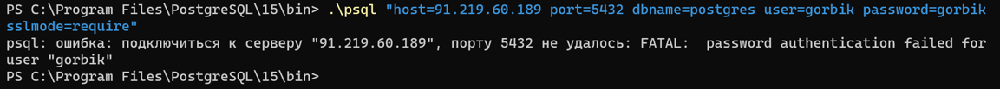

11. Від імені користувача, ім’я якого співпадає з вашим прізвищем з назви GitHub-репозиторію, повторити спробу
    встановити зв’язок із віддаленим сервером за адресою з IP=91.219.60.189, але вже через TLS/SSL-з’єднання.

