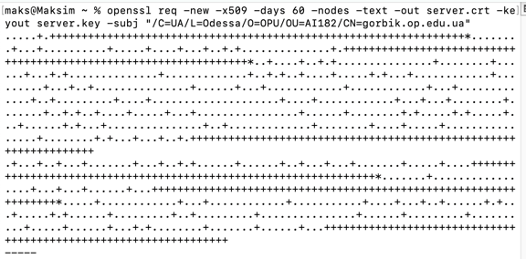

2. Створити самопідписаний сертифікат для сервера СУБД PostgreSQL з наступними параметрами:

− атрибути C=UA, L=Odessa, O=OPU, OU=group, CN=surname.op.edu.ua, де group – назва вашої групи латиницею, surname –
ваше прізвище латиницею
− строк дії сертифікату = (variant * 10) днів, де variant – значення вашого варіанту.

openssl req -new -x509 -days 60 -nodes -text -out server.crt -keyout server.key -subj 
"/C=UA/L=Odessa/O=OPU/OU=AI182/CN=gorbik.op.edu.ua"
