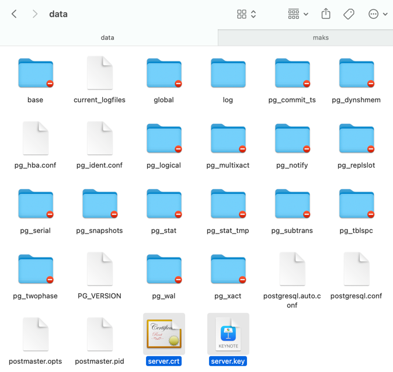
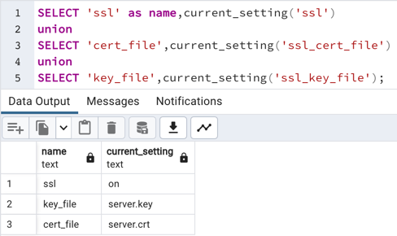

4. Скопіювати створений сертифікат відкритого ключа та закритий ключ до каталогу сервера СУБД PostgreSQL, яка
   використовувалася у лабораторній роботі No8. У конфігураційному файлі postgresql.conf налаштувати значення
   SSL-параметрів для підтримки SSL-з'єднання між сервером та клієнтами.

