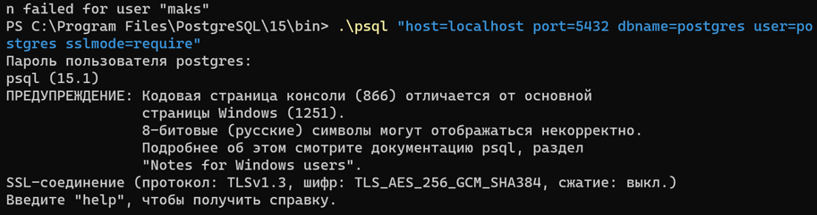

5. Використовуючи програму psql, встановити TSL/SSL-з'єднання з БД за прикладом з лабораторної роботи No8, але
   використовуючи формат параметрів "host=var1 port=var2 dbname=var3 user=var4 password=var5 sslmode=var6".
   Визначити версію TSL-протоколу та перелік використаних криптографічних алгоритмів.

Використовується протокол TLS версії 1.3, який використовує крипто-алгоритм симетричного шифрування AES із 256-бітним
ключем та режимом аутентифікаційного шифрування на основі лічильника з аутентифікацією Галуа (Galois/Counter Mode,
GCM), а також алгоритмов хешування SHA із 384-бітами.