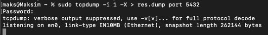

8. Запустити програму аналізу мережевих пакетів tcpdump в режимі прослуховування обраного мережевого інтерфейсу та
   налаштувати її на перегляд пакетів, які пов`язані з портом 5432 (порт прослуховування запитів СУБД PostgreSQL),
   зберігаючи зміст пакетів в окремому файлі.

