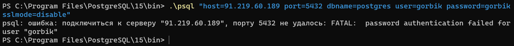
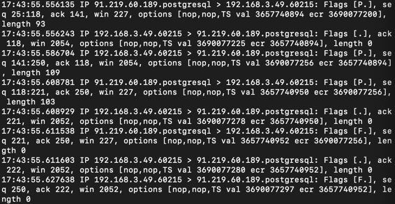

9. Від імені користувача, ім’я якого співпадає з вашим прізвищем з назви GitHub-репозиторію, виконати спробу встановити
   зв’язок із віддаленим сервером за адресою з IP=91.219.60.189 без TLS/SSL-з’єднання. Для спроби з’єднання використатуи
   будь-який пароль користувача, отримавши від сервера повідомлення про помилку процесу аутентифікації. Визначити
   версію TSL-протоколу та перелік використаних криптографічних алгоритмів.

  

Перехоплены дані:  

  

Шифрування не використовувалося
